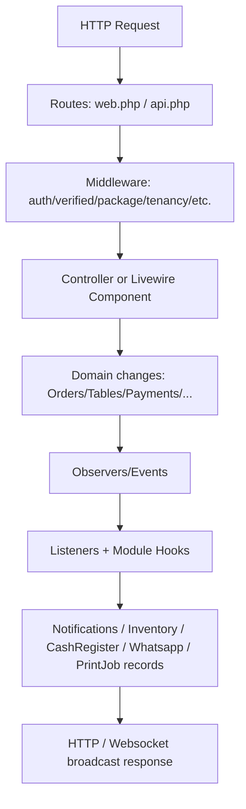
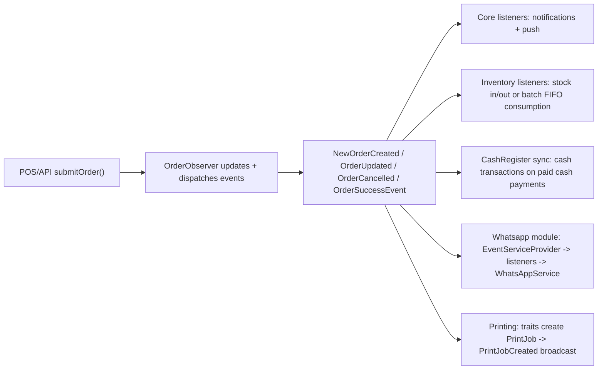

## Codebase Index (PoshResto)

This document is a “reader’s guide” that explains how the application is wired together and how major features work end-to-end. It is designed so another model (or engineer) can navigate to the right parts quickly.

### What this doc excludes
- Runtime/generated data: `vendor/`, `storage/`, `public/build/`, and other generated artifacts
- Secrets: do **not** consult or copy `.env` for behavior; use `.env.example` instead.

### How to use this doc
- Use the “Flow” sections to understand real execution paths.
- Use the “Index tables” sections to jump to the most relevant files.

---

## 1) High-level architecture

### Tech stack
- Laravel (PHP) 12.x application, with Livewire 3.x for UI
- Multi-tenant SaaS model with feature toggles via Nwidart Modules
- Event-driven side effects (notifications, inventory adjustments, Whatsapp messages, print job lifecycle)

Key entrypoints:
- Web routes: [`routes/web.php`](routes/web.php)
- API routes: [`routes/api.php`](routes/api.php)
- Console schedules (Laravel scheduler definitions): [`routes/console.php`](routes/console.php)
- Module routing: `Modules/*/Providers/RouteServiceProvider.php` (varies by module)

### Execution flow (conceptual)

---

## 2) Multi-tenancy + feature toggles

### Tenant resolution helpers
Tenant-scoped behavior is centralized in global helpers under [`app/Helper/start.php`](app/Helper/start.php), including:
- `restaurant()`, `shop()`, `branch()` session-aware accessors
- `module_enabled($moduleName)` which checks Nwidart Modules availability + enablement:
  - `Module::has($moduleName) && Module::isEnabled($moduleName)`

Important helper examples:
- [`restaurant()`](app/Helper/start.php) governs how tenant state is established
- [`module_enabled()`](app/Helper/start.php) gates module-specific routing/features

### Module system (Nwidart)
Modules are organized under `Modules/*` and are wired via each module’s providers:
- Route registration:
  - [`Modules/CashRegister/Providers/RouteServiceProvider.php`](Modules/CashRegister/Providers/RouteServiceProvider.php)
  - [`Modules/Inventory/Providers/RouteServiceProvider.php`](Modules/Inventory/Providers/RouteServiceProvider.php)
  - [`Modules/Whatsapp/Providers/RouteServiceProvider.php`](Modules/Whatsapp/Providers/RouteServiceProvider.php)
- Module lifecycle + wiring:
  - [`Modules/CashRegister/Providers/CashRegisterServiceProvider.php`](Modules/CashRegister/Providers/CashRegisterServiceProvider.php)
  - [`Modules/Inventory/Providers/InventoryServiceProvider.php`](Modules/Inventory/Providers/InventoryServiceProvider.php)
  - [`Modules/Whatsapp/Providers/WhatsappServiceProvider.php`](Modules/Whatsapp/Providers/WhatsappServiceProvider.php)

Consequence for indexing:
- “Feature availability” often means “module enabled + tenant package includes module name”.
- Route files exist in modules, but the module providers decide which routes to register for enabled modules.

---

## 3) Routing, middleware, and authorization

### Router entrypoints
- [`routes/web.php`](routes/web.php)
  - Primary UI + authenticated restaurant admin flows
  - Multi-language + tenant shop/customer endpoints
  - POS UI pages and admin resources
- [`routes/api.php`](routes/api.php)
  - Desktop/Electron print-job polling + status updates
  - Partner order listing endpoint
- [`routes/console.php`](routes/console.php)
  - Scheduled command definitions

### Middleware that meaningfully affects behavior
Core middleware classes:
- Locale + restaurant status checks:
  - [`app/Http/Middleware/LocaleMiddleware.php`](app/Http/Middleware/LocaleMiddleware.php)
- Restaurant approval/active enforcement:
  - [`app/Http/Middleware/VerifyRestaurantAccess.php`](app/Http/Middleware/VerifyRestaurantAccess.php)
- Plan/package limits (staff/menu/order caps):
  - [`app/Http/Middleware/CheckRestaurantPackage.php`](app/Http/Middleware/CheckRestaurantPackage.php)
- Superadmin gate:
  - [`app/Http/Middleware/SuperAdmin.php`](app/Http/Middleware/SuperAdmin.php)
- Desktop/electron API authentication:
  - [`app/Http/Middleware/DesktopUniqueKeyMiddleware.php`](app/Http/Middleware/DesktopUniqueKeyMiddleware.php)
- Customer-site language handling:
  - [`app/Http/Middleware/CustomerSiteMiddleware.php`](app/Http/Middleware/CustomerSiteMiddleware.php)
- Disable landing page when installation/setup is incomplete / global disable toggle:
  - [`app/Http/Middleware/DisableFrontend.php`](app/Http/Middleware/DisableFrontend.php)

### Authorization mechanics
Behavior is influenced by:
- Spatie Permission role gating and a Gate fallback in [`app/Providers/AppServiceProvider.php`](app/Providers/AppServiceProvider.php)
  - “Admin” roles get implicit permissions.
- Fortify/Jetstream redirect logic in [`app/Providers/FortifyServiceProvider.php`](app/Providers/FortifyServiceProvider.php)
  - redirects depend on onboarding completion and role:
    - `RouteServiceProvider::HOME` for admin users
    - `RouteServiceProvider::SUPERADMIN_HOME` for super admins

---

## 4) Domain model: Orders, KOT, and Tables

### Order lifecycle overview
Orders are the central “business object”. The code ties together:
- API order submission (`PosApiController`)
- UI order flows (web controllers + Livewire components)
- Observers that broadcast events and cascade order_status into KOT state

Key parts:
- Order model and relations:
  - [`app/Models/Order.php`](app/Models/Order.php)
- Order status enum:
  - [`app/Enums/OrderStatus.php`](app/Enums/OrderStatus.php)
- Observer-driven lifecycle events and KOT status cascade:
  - [`app/Observers/OrderObserver.php`](app/Observers/OrderObserver.php)

#### Important: status cascade to KOT + items
When the order’s `order_status` changes, `OrderObserver::cascadeOrderStatusToKots()` maps:
- `order_status` -> `kot.status`
- optionally `kot.items.status`

This is a core “state machine” mechanism for kitchen operations.

### Table locking (concurrency model)
Tables are locked/unlocked to prevent conflicts between staff at the POS.
Key methods on:
- [`app/Models/Table.php`](app/Models/Table.php)

Notable logic:
- `lockForUser($userId)` uses/creates a `TableSession`
- `cleanupExpiredLocks()` periodically clears stale locks
- `canBeAccessedByUser()` provides permission to take over a locked table if lock timeout rules allow.

### KOT model
Kitchen tickets (“KOT”) are modeled by:
- [`app/Models/Kot.php`](app/Models/Kot.php)

KOT generation logic:
- `generateKotNumber($branch)`
- optional token numbers are based on operational/business day boundaries.

---

## 5) POS API: submitting orders and building KOT

The “machine-facing” order API is implemented by:
- [`app/Http/Controllers/PosApiController.php`](app/Http/Controllers/PosApiController.php)

Key responsibilities:
- Identify tenant context using `branch()` and `restaurant()` helpers from `app/Helper/start.php`
- Build orders from client payload:
  - create/update `Order`
  - create `OrderItem` records (draft flow)
  - create `Kot` + `KotItem` records when KOT is requested
  - create `OrderTax` and `OrderCharge` records as needed
- Lock tables (via `setTable` flow) or unlock on cancellation/cleanup paths

Although `PosApiController` contains many endpoints, the most important conceptual path is:
1. `submitOrder()` persists order + status (`draft`, `kot`, `billed`, `canceled`)
2. `OrderObserver` reacts to persisted state changes and broadcasts events

---

## 6) Printing: PrintJob records + Electron polling

### PrintJob as a lifecycle record
Printing uses a database-backed queue-like model:
- [`app/Models/PrintJob.php`](app/Models/PrintJob.php)

Responsibilities:
- stores `image_filename`, `payload`, and status fields
- renders ESC/POS payloads to HTML for printer consumption:
  - `getHtml($paperWidthMm)`

### Creating print jobs (server side)
Print jobs are created from printing traits/controllers:
- Main printer workflow trait (order/kot printing):
  - [`app/Traits/PrinterSetting.php`](app/Traits/PrinterSetting.php)
  - It creates `PrintJob` and dispatches the broadcast event:
    - `event(new PrintJobCreated($printJob))`
- Cash register report printing:
  - [`Modules/CashRegister/Traits/CashRegisterPrintTrait.php`](Modules/CashRegister/Traits/CashRegisterPrintTrait.php)
  - Creates `PrintJob` records and dispatches `PrintJobCreated`
- Cash register controller (thermal report example):
  - [`Modules/CashRegister/Http/Controllers/CashRegisterController.php`](Modules/CashRegister/Http/Controllers/CashRegisterController.php)

### PrintJobCreated broadcast payload
- Event: [`app/Events/PrintJobCreated.php`](app/Events/PrintJobCreated.php)

The event broadcasts to `print-jobs` and includes details like:
- `print_job_id`, `printer_id`, `status`
- `payload`, `printer_info`

### Electron/desktop polling API
Desktop machines poll for print jobs and mark them done/failed using:
- [`routes/api.php`](routes/api.php)
- `PrintJobController` endpoints:
  - `pullMultiple` (sets jobs to `printing` and returns pending jobs that exist on disk)
  - `update` (patch print jobs to `done` or `failed`)

Security:
- All these endpoints are guarded by:
  - [`app/Http/Middleware/DesktopUniqueKeyMiddleware.php`](app/Http/Middleware/DesktopUniqueKeyMiddleware.php)
  - It expects the header `X-TABLETRACK-KEY` and maps it to a `Branch` via `unique_hash`.

---

## 7) Event-driven side effects: notifications, inventory, cash register, Whatsapp

### Core observer -> event -> listener pattern
Orders and reservations are broadcast/reacted upon through:
- Model observers:
  - [`app/Observers/OrderObserver.php`](app/Observers/OrderObserver.php)
  - (and others configured in [`app/Providers/AppServiceProvider.php`](app/Providers/AppServiceProvider.php))
- Application events:
  - `app/Events/*`
- Listeners:
  - `app/Listeners/*`

Example: “New order” notification
- `OrderObserver::created()` fires `event(new NewOrderCreated($order))` when status != `draft`
- Whatsapp and email/push notifications can then react:
  - Core listener example:
    - [`app/Listeners/NewOrderReceivedListener.php`](app/Listeners/NewOrderReceivedListener.php)

Example: “Bill to customer” notifications
- `StripeController::sendNotifications()` dispatches:
  - `SendNewOrderReceived` and `SendOrderBillEvent`
- Customer notification listener:
  - [`app/Listeners/SendOrderBillListener.php`](app/Listeners/SendOrderBillListener.php)

Example: “Reservation” notification
- `ReservationReceived` event:
  - [`app/Events/ReservationReceived.php`](app/Events/ReservationReceived.php)
- Listener:
  - [`app/Listeners/SendReservationListener.php`](app/Listeners/SendReservationListener.php)

### Whatsapp module: event -> listeners mapping
Whatsapp’s event wiring is defined in:
- [`Modules/Whatsapp/Providers/EventServiceProvider.php`](Modules/Whatsapp/Providers/EventServiceProvider.php)

It maps events like:
- `NewOrderCreated` -> `SendOrderConfirmationListener`
- `OrderUpdated` -> `SendOrderStatusUpdateListener`
- `OrderCancelled` -> `SendOrderCancelledListener`
- reservation + waiter events similarly

Concrete example: order cancellation listener
- [`Modules/Whatsapp/Listeners/SendOrderCancelledListener.php`](Modules/Whatsapp/Listeners/SendOrderCancelledListener.php)

Responsibilities:
- Checks whether Whatsapp is included in the tenant’s package (`restaurant_modules()`)
- Uses notification preferences:
  - `WhatsAppNotificationPreference` (type `order_cancelled` vs admin alert variants)
- Calls the service wrapper:
  - `WhatsAppNotificationService->send(...)`

Whatsapp’s API wrapper:
- [`Modules/Whatsapp/Services/WhatsAppService.php`](Modules/Whatsapp/Services/WhatsAppService.php)
  - Sends Meta Graph API template messages using access tokens, template name, and variables.

### Inventory module: event -> stock movements
Inventory’s event wiring lives in:
- [`Modules/Inventory/Providers/InventoryServiceProvider.php`](Modules/Inventory/Providers/InventoryServiceProvider.php)

It listens for:
- `NewOrderCreated` -> `UpdateInventoryOnOrderReceived`
- `OrderCancelled` -> `UpdateInventoryOnOrderCancelled`
- `NewRestaurantCreatedEvent` -> `CreateInventoryOnRestaurantCreatedListener`

The received-order flow is primarily:
- [`Modules/Inventory/Listeners/UpdateInventoryOnOrderReceived.php`](Modules/Inventory/Listeners/UpdateInventoryOnOrderReceived.php)

Key behaviors:
- If a menu item/variation uses a batch recipe, deduct from batch stock using FIFO over active batch stocks
- Otherwise, deduct regular ingredient recipes from `InventoryStock`
- Always processes modifier-option recipes for additional inventory usage

The cancellation flow reverses stock using:
- [`Modules/Inventory/Listeners/UpdateInventoryOnOrderCancelled.php`](Modules/Inventory/Listeners/UpdateInventoryOnOrderCancelled.php)

### CashRegister module: payment/order synchronization and printing
CashRegister’s cross-model synchronization is wired by its provider:
- [`Modules/CashRegister/Providers/CashRegisterServiceProvider.php`](Modules/CashRegister/Providers/CashRegisterServiceProvider.php)

It hooks into:
- `Payment::created` -> sync cash payment transactions
- `Order::saved` -> when order status becomes `paid`, sync transactions for that order (and cleanup when unpaid)

Cash syncing logic:
- [`Modules/CashRegister/Services/CashRegisterOrderSyncService.php`](Modules/CashRegister/Services/CashRegisterOrderSyncService.php)

This service:
- finds the active cash register session for the user + branch
- creates/updates `CashRegisterTransaction` rows for each cash payment on an order

---

## 8) Payments & billing integrations

Payments are implemented with gateway-specific controllers and webhook handlers.

Stripe example (core patterns):
- Checkout + recording payment intent:
  - [`app/Http/Controllers/StripeController.php`](app/Http/Controllers/StripeController.php)
- Webhook verification + updating subscription/invoice state:
  - [`app/Http/Controllers/SuperAdmin/StripeWebhookController.php`](app/Http/Controllers/SuperAdmin/StripeWebhookController.php)

Common pattern to look for in other gateways:
1. Initiate checkout/payment via gateway SDK
2. On success callback/webhook, update local subscription/payment records:
   - `GlobalSubscription`
   - `GlobalInvoice`
   - Restaurant package + activation flags
3. Trigger notifications to superadmin and/or restaurant admin when needed

---

## 9) Module index (what each module “is” in practice)

### Inventory module
- Routes (authenticated, /inventory prefix):
  - [`Modules/Inventory/Routes/web.php`](Modules/Inventory/Routes/web.php)
- Core event listeners:
  - [`Modules/Inventory/Listeners/UpdateInventoryOnOrderReceived.php`](Modules/Inventory/Listeners/UpdateInventoryOnOrderReceived.php)
  - [`Modules/Inventory/Listeners/UpdateInventoryOnOrderCancelled.php`](Modules/Inventory/Listeners/UpdateInventoryOnOrderCancelled.php)
  - [`Modules/Inventory/Listeners/CreateInventoryOnRestaurantCreatedListener.php`](Modules/Inventory/Listeners/CreateInventoryOnRestaurantCreatedListener.php)
- Module wiring:
  - [`Modules/Inventory/Providers/InventoryServiceProvider.php`](Modules/Inventory/Providers/InventoryServiceProvider.php)

### CashRegister module
- Routes (authenticated, /cash-register prefix):
  - [`Modules/CashRegister/Routes/web.php`](Modules/CashRegister/Routes/web.php)
- Sync logic:
  - [`Modules/CashRegister/Services/CashRegisterOrderSyncService.php`](Modules/CashRegister/Services/CashRegisterOrderSyncService.php)
- Print jobs for cash reports:
  - [`Modules/CashRegister/Traits/CashRegisterPrintTrait.php`](Modules/CashRegister/Traits/CashRegisterPrintTrait.php)
- Provider lifecycle wiring:
  - [`Modules/CashRegister/Providers/CashRegisterServiceProvider.php`](Modules/CashRegister/Providers/CashRegisterServiceProvider.php)

### Whatsapp module
- Webhook routes (no auth, Meta calls them):
  - [`Modules/Whatsapp/Routes/web.php`](Modules/Whatsapp/Routes/web.php)
- Event wiring:
  - [`Modules/Whatsapp/Providers/EventServiceProvider.php`](Modules/Whatsapp/Providers/EventServiceProvider.php)
- Example listener:
  - [`Modules/Whatsapp/Listeners/SendOrderCancelledListener.php`](Modules/Whatsapp/Listeners/SendOrderCancelledListener.php)
- WhatsApp API wrapper:
  - [`Modules/Whatsapp/Services/WhatsAppService.php`](Modules/Whatsapp/Services/WhatsAppService.php)

---

## 10) Lightweight data model overview (key classes only)

This table is intentionally focused on the core flow objects; the repo contains many more models and relationships.

| Model | Core relations / usage |
|---|---|
| `Order` (`app/Models/Order.php`) | Links to `Table`, `Customer`, `OrderItem`, `OrderTax`, `OrderCharge`, `Kot`, `Payment`; `generateOrderNumber()` and KOT cascade come from observers |
| `Kot` (`app/Models/Kot.php`) | Links to `Order`, `Table`, `KotItem`; generates KOT number/token number |
| `Table` (`app/Models/Table.php`) | Locking via `TableSession`; links to `Area`, `activeOrder`, reservations, waiter requests |
| `Reservation` (`app/Models/Reservation.php`) | Links to `Table` and `Customer` |
| `Payment` (`app/Models/Payment.php`) | Links to `Order` and `Refund` records |
| `PrintJob` (`app/Models/PrintJob.php`) | Stores print queue records; provides ESC/POS -> HTML conversion |
| `Printer` (`app/Models/Printer.php`) | Printer configuration and computed “printer connected” fields used by print jobs |

---

## 11) Index tables (navigation)

### Entry points
| Path | Purpose |
|---|---|
| [`routes/web.php`](routes/web.php) | Restaurant admin UI + tenant customer/public pages |
| [`routes/api.php`](routes/api.php) | Desktop/electron print job polling + partner order reads |
| [`routes/console.php`](routes/console.php) | Scheduled tasks (menu PDFs, inventory checks, print cleanup, etc.) |

### Most important “glue” files
- Tenant and module helpers: [`app/Helper/start.php`](app/Helper/start.php)
- Global service wiring: [`app/Providers/AppServiceProvider.php`](app/Providers/AppServiceProvider.php)
- Package/limit gating middleware: [`app/Http/Middleware/CheckRestaurantPackage.php`](app/Http/Middleware/CheckRestaurantPackage.php)
- Order lifecycle: [`app/Observers/OrderObserver.php`](app/Observers/OrderObserver.php)
- Printing queue + broadcast:
  - [`app/Models/PrintJob.php`](app/Models/PrintJob.php)
  - [`app/Events/PrintJobCreated.php`](app/Events/PrintJobCreated.php)
  - [`app/Http/Controllers/PrintJobController.php`](app/Http/Controllers/PrintJobController.php)

### Module routing + event wiring
- CashRegister:
  - [`Modules/CashRegister/Providers/RouteServiceProvider.php`](Modules/CashRegister/Providers/RouteServiceProvider.php)
  - [`Modules/CashRegister/Providers/CashRegisterServiceProvider.php`](Modules/CashRegister/Providers/CashRegisterServiceProvider.php)
- Inventory:
  - [`Modules/Inventory/Providers/RouteServiceProvider.php`](Modules/Inventory/Providers/RouteServiceProvider.php)
  - [`Modules/Inventory/Providers/InventoryServiceProvider.php`](Modules/Inventory/Providers/InventoryServiceProvider.php)
- Whatsapp:
  - [`Modules/Whatsapp/Providers/RouteServiceProvider.php`](Modules/Whatsapp/Providers/RouteServiceProvider.php)
  - [`Modules/Whatsapp/Providers/EventServiceProvider.php`](Modules/Whatsapp/Providers/EventServiceProvider.php)

---

## 12) Extension points (how to add things)

### Add/extend a module
Follow existing module patterns:
1. Provide routes in `Modules/<Name>/Routes/web.php` (and optionally `Routes/api.php`)
2. Provide providers:
   - Route provider registers module routes with the correct middleware/groups
   - Service provider registers translations/views/config and hooks observers/events/listeners
3. Use `module_enabled('<ModuleName>')` / `Module::isEnabled()` checks to avoid registering behavior when disabled.

### Add a new event-driven side effect
Follow the event->listener pattern:
1. Create an `app/Events/*` event class
2. Create an `app/Listeners/*` listener (or a module listener)
3. Register it:
   - core: in Laravel’s event discovery (or module provider’s EventServiceProvider)
   - module: [`Modules/Whatsapp/Providers/EventServiceProvider.php`](Modules/Whatsapp/Providers/EventServiceProvider.php) style mapping

### Add print types / queue items
Print jobs are created by:
- `app/Traits/PrinterSetting.php` for order/kot style printing
- `Modules/CashRegister/Traits/CashRegisterPrintTrait.php` for cash reports

To extend printing:
- create/format the ticket/PDF content
- create a `PrintJob` row with `status='pending'`
- dispatch `PrintJobCreated` so Electron + dashboards can react

---

## Appendix: Mermaid “order + side effects” map

